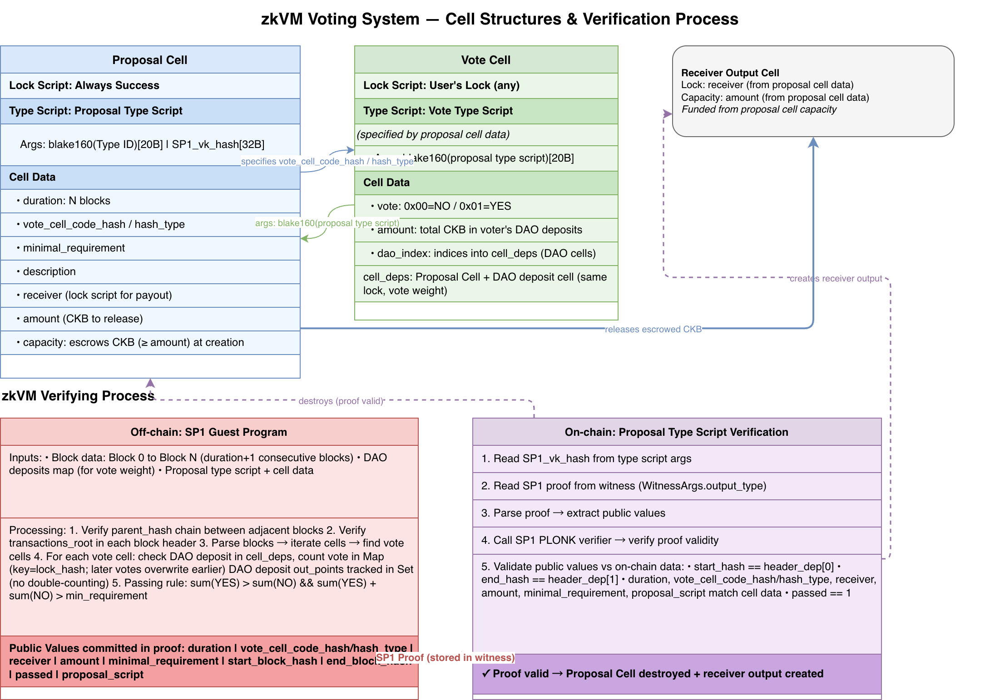
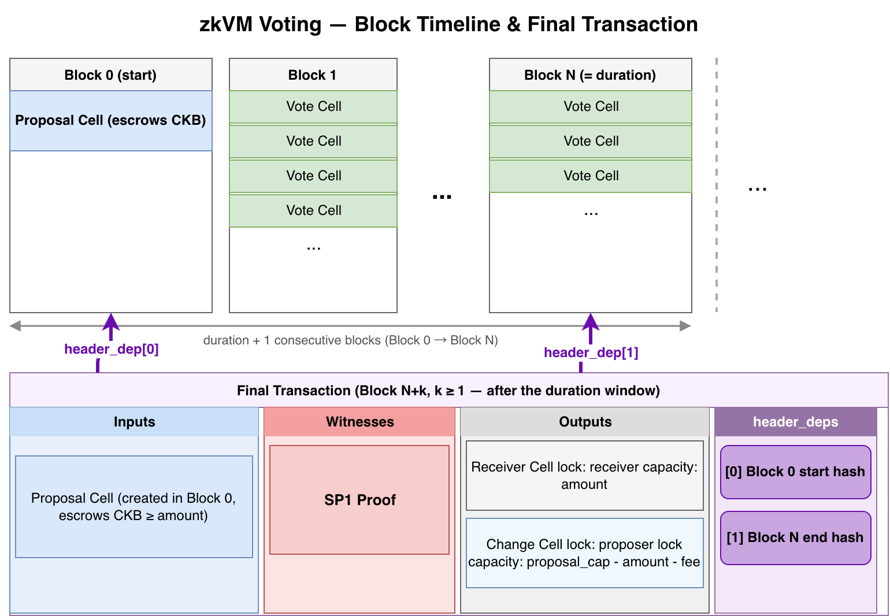
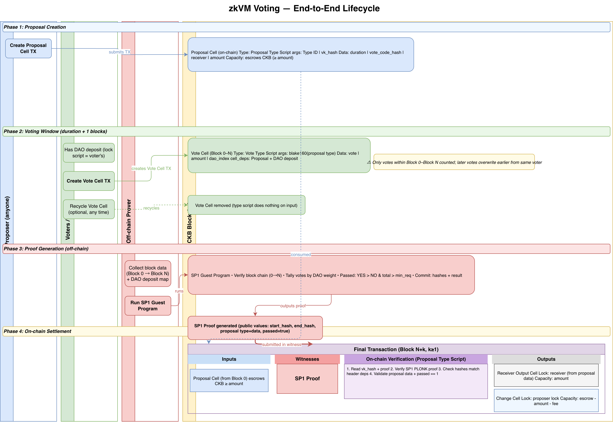

# Voting Design and implementation with zkVM on CKB-VM(Draft)

This document explains how to use a zkVM to design and implement a voting system on CKB-VM. Any zkVM (SP1, RISC Zero, etc.) can be used;
here we use SP1 since we have already ported the SP1 verifier to CKB-VM.

In the treasury, there are two systems: a creating system and a voting system.
The creating system mints CKB out of thin air, similar to a coinbase transaction.
The voting system votes on and allocates the treasury created in the previous step.
These two systems are independent and can be designed and implemented separately. This design focuses on the voting system.

## Introduction

Before diving into the implementation details, let's cover some basic concepts about what a zkVM does and how it works.

We define the *guest program* as the program running inside the zkVM. It can output public values to the *host program*.
The host program runs outside the zkVM and is responsible for verifying the proof and receiving those public values.

Using a zkVM, we can prove that the following statement is true:

```
Given a start block hash and an end block hash, there exists a cell satisfying a specific condition.
```

For example, between two blocks, we can verify that there is a cell with a specific type script whose cell data contains
exactly 1 byte with value `0xFF`.

**Guest program workflow:**

1. Read blocks sequentially, starting from `<start block hash>` and ending at `<end block hash>`.
2. Verify that `parent_hash` matches between adjacent blocks.
3. Verify that the `transactions_root` field in each block matches what is expected according to the [block structure RFC](https://github.com/nervosnetwork/rfcs/blob/master/rfcs/0027-block-structure/0027-block-structure.md). Additional verification steps can be included as needed, but we do not detail them here.
4. Parse all blocks in molecule format, read all transactions, iterate over all cells, and find the target cell.
5. Verify that the cell meets the required condition.
6. Commit (output): `<start block hash>`, `<end block hash>`: there will be in proof.
7. Generate the proof.

**Host program verification:**

1. The proof is valid.
2. Read `<start block hash>` and `<end block hash>` from proof, and verify it matches the values we provided.

Note: there is no need to execute all lock scripts and type scripts. Because the block hashes are verified, it is impossible
for the guest to tamper with the block data — if the data fed to the guest is corrupted, the guest program will fail to complete.
Overall, this approach is efficient, as it only involves block hashing and parsing operations—there are no intensive cryptographic computations like secp256k1 signing or script validation. Additionally, since CKB-VM scripts are not executed during this process, ckb-vm itself does not run, further reducing computational overhead.

Using this approach, we can do many interesting things, including implementing a voting system. The implementation is straightforward:
write a utility that reads, parses, and verifies.


## Before We Start

This document focuses on the design and partial implementation of a voting system using zkVM on CKB-VM. It is not a full specification and does not cover every implementation detail.

## Features

This design has the following features:

1. **Decentralized**: Once the on-chain scripts are deployed, the system requires no centralized team or operator. Anyone can create a proposal and vote. When a vote passes, funds can be withdrawn from the treasury.
2. **Double-vote resistant**: Some vote designs are vulnerable to an attack where a voter votes, withdraws their DAO deposit, redeposits to a second address, and votes again. This design prevents that.
3. **Flexible vote rules**: Because vote counting is implemented in a zkVM, all relevant data is available at counting time. This makes it straightforward to implement complex vote rules — something that is difficult under a pure UTXO model, where a script cannot observe the full picture of all data.
4. **Reusable**: The proposal and vote scripts are not treasury-specific and can be integrated into third-party systems.
5. **Stake-weighted voting**: Voting power is proportional to CKB held in Nervos DAO deposits, not one-address-one-vote. This aligns influence with economic stake in the network.
6. **Vote retractability**: Voters can change or retract their vote at any time during the voting window. 
7. **Low participation cost**: Casting a vote only requires a small amount of CKB to occupy the vote cell. Voters can reclaim the vote cell CKB at any time — they do not have to wait until the voting window closes.
8. **Permissionless settlement**: Once a proposal passes, anyone can generate and submit the SP1 proof to trigger fund disbursement. There is no designated operator or trusted party required to finalize the outcome.
9. **Cryptographically verifiable vote counting**: The zkVM proof guarantees that votes are counted correctly and honestly across the specified block range. 


## Proposal Cell

A proposal cell is the central element of the design. It can be created by anybody. It represents a proposal, and once it appears on-chain, voting begins. Users can cast votes in response to the proposal.

The lock script of a proposal cell is always a success lock script. All access control is delegated to the type script described below.

The type script of a proposal cell is called the proposal type script. Its `args` are defined as:

```text
<20-byte blake160 hash of Type ID> <32-bytes SP1 verifying key>
```

See details in [Proposal Type Script Specification](../proposal-type-script.md).

## Vote Cell

Once the proposal cell is on-chain, users can cast their votes by creating vote cells. Each vote cell's data contains the vote result — typically a simple yes or no.

The vote cell's lock script can be anything, as users may recycle these cells immediately after voting. 

See details in [Vote Type Script Specification](../vote-type-script.md).

## Benchmark and Optimization

We benchmarked the solution against 500 mainnet blocks. The total cost is approximately 34M cycles, broken down into two categories:

1. `verify_transaction_root`: The most expensive step. It computes all transaction hashes, builds a Merkle tree, and then derives the transaction root — costing about 28M cycles.
2. Other checks (block header hash verification, cell traversal, etc.): about 6M cycles.

At this rate, processing one day's worth of blocks (assuming one block every 10 seconds) would cost roughly 500M cycles.

## SP1 Proof Price via prover network

Proofs can be generated via the SP1 [prover network](https://docs.succinct.xyz/docs/sp1/prover-network/quickstart). The following estimates are based on these assumptions (as of 2026/05):

- PROVE price: 0.277 USDT
- Price per bPGU: 0.54 PROVE
- Base fee: 0.3 PROVE
- CKB block interval: 10s

With 500 blocks, proof generation costs approximately 39M gas (cycles). Scaled to one day: `39 / (500 × 10) × 3600 × 24 ≈ 674 M gas/day`.

Using the SP1 pricing formula:

```
total fee = base fee + price per bPGU × gas
```

| Duration | PROVE  | Cost (USDT) |
|----------|--------|-------------|
| 1 day    | 0.66   | 0.18        |
| 2 days   | 1.03   | 0.29        |
| 3 days   | 1.39   | 0.39        |
| 4 days   | 1.76   | 0.49        |
| 5 days   | 2.12   | 0.59        |
| 6 days   | 2.48   | 0.69        |
| 7 days   | 2.85   | 0.79        |

A sample proof generated by the guest program is available on the prover network: [explorer.succinct.xyz](https://explorer.succinct.xyz/request/0x5af072d61db8aaf613549dd12da80ecc09d0a2fe4c3687a8d816d25fef2ae52b)

## Self-host prover

In addition to the prover network, you can set up a self-hosted prover to generate proofs locally. See the [SP1 hardware requirements](https://docs.succinct.xyz/docs/sp1/getting-started/hardware-requirements) for details.

The minimum requirements for Groth16 / PLONK (EVM-compatible) proving are:

| Component | Requirement |
|-----------|-------------|
| CPU       | 16+ cores   |
| Memory    | 16 GB+ (32 GB+ recommended for proof aggregation) |
| Disk      | 10 GB+      |

- CPU: High core count helps, as hashing and field operations parallelize well across cores.
- Memory: The prover keeps large trace matrices in RAM. If using proof aggregation with Docker Desktop, increase the memory limit to at least 32 GB.
- Disk: Used for the SP1 toolchain, circuit artifacts, and execution checkpoints.

For GPU-accelerated proving:

| Component    | Requirement                                        |
|--------------|----------------------------------------------------|
| GPU          | NVIDIA, CUDA Compute Capability ≥ 8.6, 24 GB+ VRAM |
| CUDA drivers | ≥ 12.5.1                                           |
| Other        | Docker, NVIDIA Container Toolkit                   |

Below are two example build configurations:

Budget build (~$3k–5k)

| Component | Recommendation |
| --------- | -------------- |
| GPU       | RTX 4090       |
| CPU       | Ryzen 9 9950X  |
| RAM       | 64–128 GB DDR5 |

Serious build (~$6k–10k)

| Component | Recommendation     |
| --------- | ------------------ |
| GPU       | RTX 5090           |
| CPU       | Threadripper 7970X |
| RAM       | 128–256 GB         |


## Diagrams

The following diagram shows the static structure of the two core cell types and how they interact through the zkVM verifying process:




The diagram below shows the block timeline: `duration + 1` consecutive blocks (Block 0 through Block N) contain the proposal cell and vote cells, while the final transaction — which consumes the proposal cell — lives in a later block outside that window.



The diagram below gives a bird's-eye view of the entire voting lifecycle across all four phases and actors. 



